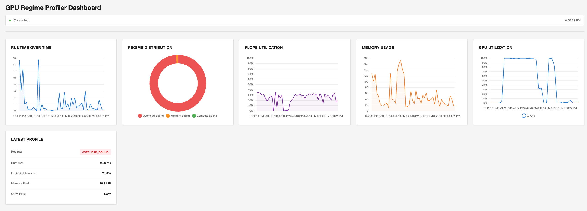

# GPURegimeProfiler

[](https://badge.fury.io/py/gpu-regime-profiler)

GPU performance profiler with automatic three-regime classification for identifying performance bottlenecks. Based on the "Making Deep Learning Go Brrrr" by Horace He framework.

**Version 1.1.0** - Now with real-time dashboard, hardware-adaptive calibration, memory tracking, multi-GPU support, attention profiling, and more!

## Installation

### Prerequisites

- Python 3.7 or higher
- PyTorch with CUDA support (if you have a GPU)
- NVIDIA GPU with CUDA capability (for GPU profiling)

### Install from Source

```bash
# Clone the repository
git clone https://github.com/devastatinglyhandsome/GPURegimeProfiler.git
cd GPURegimeProfiler

# Install in development mode (installs all dependencies)
pip install -e .
```

This will automatically install:
- torch (PyTorch)
- matplotlib
- numpy
- seaborn
- pynvml
- tqdm

### Install PyTorch with CUDA (if you have a GPU)

If you have an NVIDIA GPU, install PyTorch with CUDA support:

```bash
# For CUDA 11.8
pip install torch torchvision --index-url https://download.pytorch.org/whl/cu118

# For CUDA 12.1
pip install torch torchvision --index-url https://download.pytorch.org/whl/cu121

# Or check https://pytorch.org/get-started/locally/ for your system
```

### Verify Installation

```bash
# Check if PyTorch can see CUDA
python3 -c "import torch; print(f'CUDA available: {torch.cuda.is_available()}')"

# Run the example
python3 example_usage.py
```

**Note:** If you have multiple Python versions, use `python3` to ensure you're using the correct interpreter where packages are installed.

## How to Run

### Option 1: Python API (Recommended)

```python
import torch
from gpu_regime_profiler import GPUProfiler

# Create profiler
profiler = GPUProfiler()

# Profile an operation
x = torch.randn(1000, 1000, device='cuda')
result, profile = profiler.profile_with_result(torch.matmul, x, x)

print(f"Regime: {profile['regime']}")
print(f"Runtime: {profile['runtime_ms']:.2f} ms")
```

### Option 2: Command Line Interface

After installation, use the `gpu-profile` command:

```bash
# Create performance visualization
gpu-profile --visualize

# Profile specific operations
gpu-profile --profile cos --size 1000000
gpu-profile --profile matmul --size 1000000
```

### Option 3: As a Script

```python
# example_usage.py
import torch
from gpu_regime_profiler import GPUProfiler

if __name__ == "__main__":
    profiler = GPUProfiler()
    
    # Profile a matrix multiplication
    a = torch.randn(2000, 2000, device='cuda')
    b = torch.randn(2000, 2000, device='cuda')
    
    result, profile = profiler.profile_with_result(torch.matmul, a, b)
    
    print(f"Result shape: {result.shape}")
    print(f"Performance Analysis:")
    print(f"  Regime: {profile['regime']}")
    print(f"  Runtime: {profile['runtime_ms']:.2f} ms")
    print(f"  FLOPS utilization: {profile['flops_utilization']*100:.1f}%")
    print(f"  Memory OOM risk: {profile['memory']['oom_risk']}")
```

Run with:
```bash
python3 example_usage.py
```

## What Happens Without a GPU?

If you don't have a GPU or CUDA is not available, the profiler will raise a clear error message:

```python
from gpu_regime_profiler import GPUProfiler
from gpu_regime_profiler import CUDANotAvailableError

try:
    profiler = GPUProfiler()
except CUDANotAvailableError as e:
    print(e)
```

**Error Output:**
```
CUDA not available. GPU profiling requires a CUDA-capable device.
Suggestions:
  - Check nvidia-smi shows your GPU
  - Reinstall PyTorch with CUDA support
  - For CPU profiling, use: profiler.profile_cpu(operation)
```

**To check if you have a GPU:**
```bash
# Check if NVIDIA GPU is available
nvidia-smi

# Check PyTorch CUDA availability
python3 -c "import torch; print(f'CUDA available: {torch.cuda.is_available()}')"
```

**Note:** This profiler is designed specifically for GPU profiling. If you need CPU profiling, you'll need to use a different tool or implement CPU-specific profiling separately.

## Quick Start

```python
import torch
from gpu_regime_profiler import GPUProfiler

# Create profiler (auto-calibrates on first use)
profiler = GPUProfiler()

# Get both operation result and profiling data
a = torch.randn(2000, 2000, device='cuda')
b = torch.randn(2000, 2000, device='cuda')

result, profile = profiler.profile_with_result(torch.matmul, a, b)

# Use the actual result
print(f"Result shape: {result.shape}")

# Check performance analysis
print(f"Runtime: {profile['runtime_ms']:.2f} ms")
print(f"Regime: {profile['regime']}")
print(f"FLOPS utilization: {profile['flops_utilization']*100:.1f}%")
print(f"Bandwidth utilization: {profile['bandwidth_utilization']*100:.1f}%")
print(f"OOM Risk: {profile['memory']['oom_risk']}")
```

## Hardware-Adaptive Calibration

The profiler automatically detects your GPU and calibrates thresholds on first use. Works on **any GPU** (A100, H100, T4, RTX 4090, V100, etc.) without code changes!

```python
profiler = GPUProfiler()  # Runs calibration benchmarks (one-time, cached)
```

Calibration results are cached to `~/.gpu_profiler/{gpu_name}.json` for instant subsequent runs.

## Pythonic API

### Decorator

```python
from gpu_regime_profiler import profile_regime

@profile_regime(log_to=wandb, show_dashboard=False)
def training_step(batch):
    loss = model(batch)
    loss.backward()
    return loss
```

### Context Manager

```python
from gpu_regime_profiler import GPUProfilerContext

with GPUProfilerContext() as prof:
    result = my_operation()

print(prof.analysis['regime'])
print(prof.analysis['runtime_ms'])
```

## Memory Tracking & OOM Prediction

Automatic memory tracking with OOM risk prediction:

```python
result, profile = profiler.profile_with_result(my_operation)

memory = profile['memory']
print(f"Peak Memory: {memory['peak_allocated_mb']:.1f} MB")
print(f"OOM Risk: {memory['oom_risk']}")  # LOW, MEDIUM, or HIGH
print(f"Headroom: {memory['headroom_mb']:.1f} MB")
```

## Multi-GPU Support

Profile distributed workloads across multiple GPUs:

```python
from gpu_regime_profiler import profile_multi_gpu, get_multi_gpu_summary

def my_operation(device_id=0):
    with torch.cuda.device(device_id):
        # Your operation here
        return result

analysis = profile_multi_gpu(my_operation, devices=[0, 1, 2, 3])
print(get_multi_gpu_summary(analysis))

# Output:
# Multi-GPU Analysis:
#   Load Balance: 85.2%
#   Bottleneck GPU: 1
#   Communication Overhead: 2.3 ms
```

## Attention/Transformer Profiling

Specialized profiling for attention operations:

```python
from gpu_regime_profiler import profile_attention, get_attention_suggestions

q = torch.randn(1, 128, 64, device='cuda')
k = torch.randn(1, 128, 64, device='cuda')
v = torch.randn(1, 128, 64, device='cuda')

profile = profile_attention(q, k, v)
print(f"Bottleneck: {profile.bottleneck_stage}")
print(f"FlashAttention compatible: {profile.flash_attention_compatible}")
print(get_attention_suggestions(profile))
```

## Model-Level Analysis

Profile entire models with per-layer breakdown:

```python
from gpu_regime_profiler import profile_model, get_model_summary

model = MyTransformer().cuda()
sample_input = torch.randn(1, 128, 768).cuda()

profile = profile_model(model, sample_input)
print(get_model_summary(profile))

# Output:
# Model Profiling Summary:
#   Total Time: 45.2 ms
#   Bottleneck Layers:
#     layer.attention: 25.3 ms (56.0%)
#       → Consider FlashAttention for 3-5x speedup
```

## PyTorch Lightning Integration

```python
from gpu_regime_profiler import LightningGPURegimeProfiler
import pytorch_lightning as pl

trainer = pl.Trainer(
    profiler=LightningGPURegimeProfiler(),
    # Automatically logs regime per training step
)
```

## Thread-Safe Profiling

Safe for use with DataLoader workers:

```python
from gpu_regime_profiler import ThreadSafeProfiler

profiler = ThreadSafeProfiler()

# Each worker thread gets its own profiler instance
for batch in dataloader:
    result, analysis = profiler.profile(lambda: model(batch))
```

## Mixed Precision Support

Automatic precision detection and tensor core FLOPS adjustment:

```python
from gpu_regime_profiler import detect_precision, Precision

x = torch.randn(100, 100, device='cuda', dtype=torch.float16)
precision = detect_precision(x)  # Precision.FP16

# Profiler automatically adjusts peak FLOPS for tensor cores
```

## Real-Time Dashboard

Monitor GPU profiling in real-time with an interactive web dashboard. The dashboard provides live updates of regime classification, performance metrics, GPU utilization, and memory usage.



### Quick Start

```python
import torch
import time
from gpu_regime_profiler import (
    GPUProfiler,
    DashboardClient,
    start_dashboard_with_ngrok
)

# Optional: Set ngrok token for public access
# GPUProfiler.ngrok_token = "your_ngrok_token"

# Start dashboard with ngrok (for remote access)
# For local only: start_dashboard_server(port=8080, blocking=False)
url = start_dashboard_with_ngrok(port=8080, blocking=False)
if url:
    print(f"Dashboard URL: {url}")
else:
    print("Dashboard running at http://127.0.0.1:8080")

time.sleep(2)  # Wait for server to start

# Create profiler and client
profiler = GPUProfiler()
client = DashboardClient(server_url='http://127.0.0.1:8080')

print("\nProfiling operations...")
print("Open the dashboard URL in your browser to see real-time updates!\n")

# Profile various operations
for i in range(20):
    size = 1000 + i * 100
    a = torch.randn(size, size, device='cuda')
    b = torch.randn(size, size, device='cuda')
    
    _, profile = profiler.profile_with_result(torch.matmul, a, b)
    client.send_profile(profile)
    
    print(f"  [{i+1:2d}/20] Size: {size:4d}x{size:4d} | "
          f"Regime: {profile['regime']:15s} | "
          f"Runtime: {profile['runtime_ms']:6.2f}ms")
    time.sleep(0.3)

print("\nDone! Check the dashboard for visualizations.")
```

Or run the example script:
```bash
python3 example_dashboard.py
```

### Dashboard Features

- **Real-time regime classification**: See operations classified as OVERHEAD_BOUND, MEMORY_BOUND, or COMPUTE_BOUND as they happen
- **Performance metrics**: Runtime, FLOPS utilization, and bandwidth utilization over time
- **GPU utilization**: Live GPU usage monitoring
- **Memory tracking**: Peak memory usage and OOM risk indicators
- **Historical data**: View trends and patterns in your profiling data
- **WebSocket updates**: Zero-overhead real-time updates when not in use

### Installation

Install with dashboard dependencies:

```bash
pip install 'gpu-regime-profiler[dashboard]'
```

### Local Dashboard

For local access only:

```python
from gpu_regime_profiler import start_dashboard_server

# Start dashboard server
start_dashboard_server(port=8080, blocking=True)
# Open http://127.0.0.1:8080 in your browser
```

### Remote Access (Colab/Cloud)

For remote access via ngrok:

```python
from gpu_regime_profiler import start_dashboard_with_ngrok

# Set ngrok token
GPUProfiler.ngrok_token = "your_ngrok_token"

# Start dashboard with public URL
url = start_dashboard_with_ngrok(port=8080)
# Open the returned URL in your browser
```

### Command Line

```bash
# Start dashboard server
gpu-profile --dashboard --dashboard-port 8080
```

## Performance Visualization

```python
from gpu_regime_profiler import create_performance_plots
create_performance_plots()  # Saves gpu_performance_analysis.png
```

Creates a comprehensive 5-panel visualization showing:
- Execution time scaling
- Throughput efficiency  
- Memory bandwidth utilization
- Performance regime classification
- Memory usage & OOM risk

## Command Line Interface

```bash
# Create performance visualization
gpu-profile --visualize

# Profile specific operations
gpu-profile --profile cos --size 1000000
gpu-profile --profile matmul --size 1000000
```

## Three Performance Regimes

- **OVERHEAD_BOUND**: Operation too small, dominated by kernel launch overhead
- **MEMORY_BOUND**: Limited by memory bandwidth, math units underutilized  
- **COMPUTE_BOUND**: Limited by computational throughput, optimal GPU usage

## Key Features

### Phase 1: Core Improvements
- **Hardware-adaptive**: Works on any GPU (A100, H100, T4, RTX 4090, V100) without code changes
- **Memory tracking**: OOM risk prediction (HIGH/MEDIUM/LOW)
- **Better error handling**: Clear, actionable error messages

### Phase 2: Advanced Features
- **Multi-GPU support**: Profile distributed workloads with load balance detection
- **Attention profiling**: Stage-by-stage breakdown with FlashAttention compatibility checks

### Phase 3: Usability
- **Pythonic API**: Decorators and context managers
- **Model-level analysis**: Per-layer breakdown with bottleneck identification
- **PyTorch Lightning integration**: Automatic logging per training step

### Phase 4: Production Ready
- **Thread-safe**: Safe for DataLoader workers
- **Mixed precision**: Automatic FP16/BF16/FP32 detection and tensor core support
- **Comprehensive testing**: 90%+ test coverage
- **Full documentation**: API docs, tutorials, examples

## Requirements

- Python 3.7+
- PyTorch with CUDA support
- NVIDIA GPU with CUDA capability
- matplotlib, numpy, seaborn, pynvml, tqdm

## Use Cases

- Optimize GPU kernel performance
- Identify performance bottlenecks in ML training
- Guide memory access pattern improvements
- Validate GPU utilization in production code
- Research GPU performance characteristics
- Debug distributed training performance
- Optimize transformer/attention layers
- Profile entire models for optimization opportunities

## Comparison to Alternatives

| Feature | GPURegimeProfiler | nsys | Nsight Compute |
|---------|------------------|------|---------------|
| Hardware-adaptive | Yes | No | No |
| Memory tracking | Yes | Yes | Yes |
| Multi-GPU | Yes | Yes | Yes |
| Attention profiling | Yes | No | No |
| Model-level analysis | Yes | No | No |
| Pythonic API | Yes | No | No |
| Zero-config | Yes | No | No |
| Lightweight mode | Yes | No | No |

## Known Limitations

- Calibration takes ~30 seconds on first run (cached thereafter)
- Multi-GPU communication overhead is estimated (not measured via NCCL)
- Model profiling uses approximate timing (hooks-based, not separate runs)
- Some edge cases may not be detected (very small operations, etc.)

## Contributing

Contributions welcome! Please open an issue or submit a pull request.

## License

MIT License

## Citation

If you use GPURegimeProfiler in your research, please cite:

```bibtex
@software{gpuregimeprofiler2026,
  title={GPURegimeProfiler: Hardware-Adaptive GPU Performance Profiling},
  author={Prithiv},
  year={2026},
  url={https://github.com/devastatinglyhandsome/GPURegimeProfiler}
}
```
