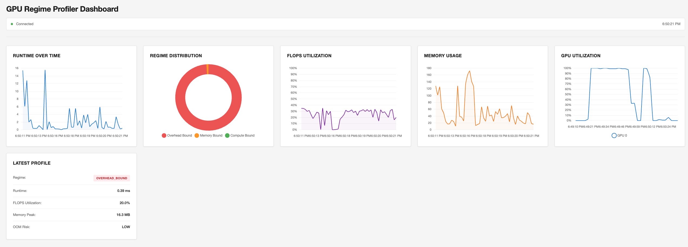

# GPURegimeProfiler

[](https://badge.fury.io/py/gpu-regime-profiler)

Classify GPU ops as **OVERHEAD_BOUND**, **MEMORY_BOUND**, or **COMPUTE_BOUND** so you can see whether slowness is launch overhead, memory bandwidth, or compute. Works on any NVIDIA GPU; calibration is automatic and cached.

---

## Quick start (no dashboard)

```bash
pip install gpu-regime-profiler
```

You need PyTorch with CUDA. If you have an NVIDIA GPU:

```bash
pip install torch --index-url https://download.pytorch.org/whl/cu121
```

Then:

```python
import torch
from gpu_regime_profiler import GPUProfiler

profiler = GPUProfiler()
x = torch.randn(2000, 2000, device='cuda')
result, profile = profiler.profile_with_result(torch.matmul, x, x)

print(profile['regime'])       # e.g. COMPUTE_BOUND
print(profile['runtime_ms'])   # e.g. 0.42
```

First run does a one-time calibration (~30 s); later runs use the cache.

---

## No GPU?

You get a clear error: `CUDANotAvailableError` with suggestions (check `nvidia-smi`, reinstall PyTorch with CUDA). The profiler is for GPU only.

---

## Real-time dashboard (optional)

The dashboard shows regime breakdown, runtimes, and GPU utilization in a browser. **Use local mode first**; it works without any account or token.



### Local dashboard (recommended)

```bash
pip install 'gpu-regime-profiler[dashboard]'
```

In one terminal or notebook cell:

```python
from gpu_regime_profiler import start_dashboard_server

start_dashboard_server(port=8080, blocking=False)
# Open http://127.0.0.1:8080 in your browser
```

In your code, send profiles to the dashboard:

```python
from gpu_regime_profiler import GPUProfiler, DashboardClient

profiler = GPUProfiler()
client = DashboardClient(server_url='http://127.0.0.1:8080')

a = torch.randn(2000, 2000, device='cuda')
_, profile = profiler.profile_with_result(torch.matmul, a, a)
client.send_profile(profile)
```

Refresh the page to see updates. No ngrok, no token, no signup.

### On Google Colab (no ngrok)

Use the Colab helper so you don't need ngrok. In a Colab cell:

```python
!pip install -q 'gpu-regime-profiler[dashboard]'
```

```python
import torch
from gpu_regime_profiler import start_dashboard_colab, GPUProfiler, DashboardClient

start_dashboard_colab(port=8080)   # Embeds in notebook or use "Open preview" link

profiler = GPUProfiler()
client = DashboardClient(server_url='http://127.0.0.1:8080')
a = torch.randn(2000, 2000, device='cuda')
_, profile = profiler.profile_with_result(torch.matmul, a, a)
client.send_profile(profile)
```

The dashboard appears in the notebook (iframe) or via Colab's "Open preview" for port 8080. No ngrok, no SSL errors.

### Remote / Colab with ngrok (only if you need a public URL from outside Colab)

If you run code in Colab and want to open the dashboard from your laptop in a separate browser. Options:

1. **Colab port preview (recommended)**  
   Use `start_dashboard_colab(port=8080)` above, then use the "Open preview" link Colab shows. No ngrok.

2. **ngrok (skip if Colab preview works)**  
   In Colab, use “Local runtimes” or the built-in port preview if available (e.g. “Open preview” for the port you use). No ngrok.

2. **ngrok**  
   Only if you specifically want an ngrok URL:
   - Sign up at [ngrok](https://ngrok.com), get an auth token.
   - Install dashboard extras and set the token, then start the server:

```python
from gpu_regime_profiler import GPUProfiler, start_dashboard_with_ngrok

GPUProfiler.ngrok_token = "YOUR_NGROK_TOKEN"
url = start_dashboard_with_ngrok(port=8080, blocking=False)
print(url)  # Open this in your browser
```

If ngrok fails (connection refused, auth, or tunnel issues), use the **local dashboard** on the machine where the code runs and open it via that machine’s port (e.g. Colab’s port preview or SSH port forwarding). The dashboard itself does not require ngrok.

**ERR_SSL_PROTOCOL_ERROR / "invalid response"**: Open the URL with **https://** (ngrok gives HTTPS). Try incognito or a different browser; some networks or proxies break ngrok's TLS. If it still fails, skip ngrok and use Colab port preview or SSH port forwarding instead.

---

## What the three regimes mean

- **OVERHEAD_BOUND** – Kernel launch overhead dominates; the op is too small to keep the GPU busy.
- **MEMORY_BOUND** – Limited by memory bandwidth; compute units are underused.
- **COMPUTE_BOUND** – Limited by math throughput; good GPU utilization.

Most people don’t realize a “slow kernel” is often just waiting on memory; this tool makes that explicit.

---

## Overhead and calibration

- **Profiling overhead**: The instrumentation is designed to add minimal latency; the main cost is a few CUDA events per op. Calibration runs once per GPU and is cached in `~/.gpu_profiler/`.
- **Different GPUs**: Calibration measures your card’s peak FLOPS and memory bandwidth, so consumer vs datacenter (e.g. A100, H100, T4, RTX) differences are reflected in the thresholds.

---

## CLI

```bash
gpu-profile --visualize
gpu-profile --profile matmul --size 1000000
gpu-profile --dashboard --dashboard-port 8080
```

---

## More features (short)

- **Decorator**: `@profile_regime(log_to=wandb)` for training steps.
- **Context manager**: `with GPUProfilerContext() as prof: ...`
- **Memory**: `profile['memory']` has `peak_allocated_mb`, `oom_risk`, `headroom_mb`.
- **Multi-GPU**: `profile_multi_gpu(my_fn, devices=[0,1,2,3])`.
- **Attention**: `profile_attention(q,k,v)` with FlashAttention compatibility hints.
- **Model-level**: `profile_model(model, sample_input)` for per-layer breakdown.
- **PyTorch Lightning**: `Trainer(profiler=LightningGPURegimeProfiler())`.
- **Thread-safe**: `ThreadSafeProfiler()` for DataLoader workers.
- **Mixed precision**: FP16/BF16/FP32 detected automatically.

---

## Requirements

- Python 3.7+
- PyTorch with CUDA
- NVIDIA GPU  
- Dashboard: `pip install 'gpu-regime-profiler[dashboard]'` (adds FastAPI, uvicorn, etc.)

---

## Citation

```bibtex
@software{gpuregimeprofiler2026,
  title={GPURegimeProfiler: Hardware-Adaptive GPU Performance Profiling},
  author={Prithiv},
  year={2026},
  url={https://github.com/devastatinglyhandsome/GPURegimeProfiler}
}
```

License: MIT. Contributions welcome.
